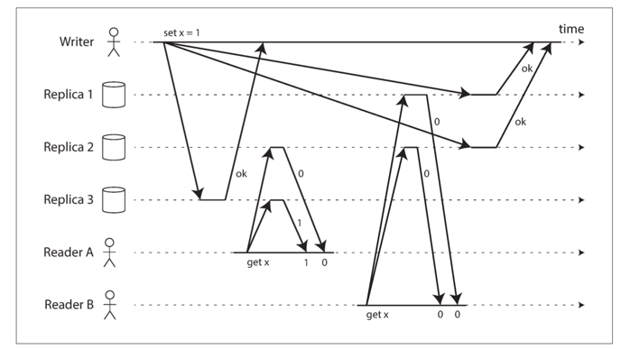

##### Basic
- client sends its write to several replicas directly or via a coordinator
but the coordinator doesn't enforce a particular order of writes
- when client reads from DB, it sends read request to several nodes
in parallel. Client may get different response from different nodes, version
numbers are used to determine which value is newer.
- Dynamo, Cassandra, Riak
- Eventually consistency

##### Read repair and anti-entropy
- After an unavailable node comes back online, how does it catch up on the writes
that it missed:
    - Read repair: when a client read from several nodes, it can detect stale 
    response. It will write newer value back to that replica => read repair 
    is only performed when a value is read by application
    - Anti-entropy: a background process constantly looks for differences in data
    between nodes and copies any missing data from one replica to another.
- suitable for systems require:
    - high availability
    - low latency
    - tolerate occasional stale reads
##### Quorums
- n replicas
- every write must be confirmed by w nodes to be successful
- every read must be confirmed by r nodes to be successful
- if `w + r > n` => quorum
=> we expect to get an up-to-date value when reading because
at least one of r nodes we are reading from must be up to date.
Example: n = 3, w = r = 2.

- Dynamo-style: `w = r = (n+1)/2` and `n % 2 == 1`.
- fault tolerance:
    - if w < n, we can still process writes if a node is down
    - if r < n, we can still process reads if a node is down

- a workload with heavy read may benefit from setting: w = n, r = 1    
- limitations:
    - latency
    - if write succeed on some nodes (< w) but failed on others => the write
    is reported as failed, but it is not rolled back on the node where it succeeded.
    => subsequent reads may or may not return the value from the write
    example: n = 5, r = w = 3. x = 1. A write update x = 2, successful in 2 nodes (1) and (2)
    failed in 3 nodes (3), (4), (5) => it is a fail write. A subsequent read gets the value of 
    x can get x = 2 (if it reads from (1), (2), (3)), or it can get x = 1 if 
    reading from (3), (4), (5).
    - edge case when quorum setting cannot guarantee strong consistency: n = w = 3, r = 2
    
    
    
=> still eventually consistency, not read your write or monotonic read    