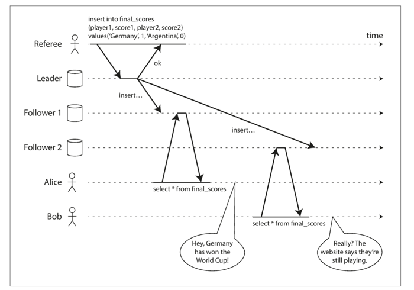

#### Background
- Linearizability: a.k.a atomic consistency, strong consistency, to make
the system appear as if there were only one copy of the data and all
operations on it are atomic.
- A.s.a a client successfully write, all clients reading from DB must be
able to see the written value.

- Example of Linearizability's violation:

#### Where is it useful?
##### Locking and Leader election
- electing leader in single-leader replication using lock: all nodes must
agree which node owns the lock => lock need to be `Linearizability`
- example of coordination servers: ZooKeeper, etcd
##### Constraints and uniqueness
- avoid oversell stock in warehouse
- avoid 2 people concurrently book a seat on a flight
##### Cross-channel timing dependencies

Example: user upload an image to Web Server, Web server notifies Image resizer to
resize the image in DB via a Message queue. There are 2 communication channels here:
- File storage
- Message queue

=> there could be a race condition between them: if the `deliver message`
comes before `store full-size image` event, Image resizer cannot do its job

#### Implementation

#### The cost of Linearizability
- Most of distributed DB choose not to provide Linearizability to increase
performance, not so much for fault tolerance.
- it is proven that if you want Linearizability, the response time
of read and write requests is at lease proportional to the uncertainty of delays 
in the network. In other word, a `fast Linearizability algorithm does not exist`.
- CAP
    - if your app requires Linearizability and some nodes are disconnected from other 
    due to network problem => they cannot process requests while they are disconnected
    => they must wait until network problem resolved or return error (i.e. become 
    unavailable)
    - CAP theorem only consider 1 consistency model (Linearizability) and 1 kind of 
    fault (network parition <=> nodes are alive but disconnected from others). 
    It doesn't say anything about network delays, dead nodes.