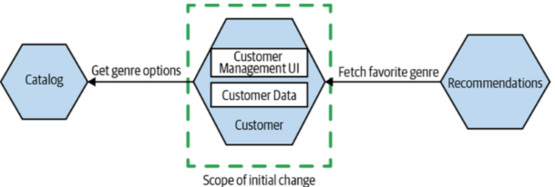

#### Def
1. Independent Deployability
- loosely coupled
- release changes to 1 single services without to deploy anything else

2. Model around **business domain**
- 3-tier architect

- MS architect

- Own their own data
> Don’t share databases, unless you really have to. And even then do everything you can to avoid it. In my opinion, it’s one of the worst things you can do if you’re trying to achieve independent deployability.

##### Advantage
- allow you to mix and match technology (language, programming
styles, deployment platform, db ..)
- services can be worked on in parallel
- engineer focuses on just 1 service
- **flexibility**

##### Disadvantage
- Network: latencies, unpredictable behavior
- Consistent view of data across machines

> It’s worth noting that virtually all of the systems we categorize 
as `monoliths` are also distributed systems.

#### Monolith
##### Types
1. Single process monolith

2. Distributed monolith
- multiple services
- entire system has to be deployed together

3. 3rd party black-box system
- you dont have control

##### Advantage
- monolith is not legacy, it is a valid choice of architect
- reuse code is straightforward
- simpler deploy topology, simpler developer workflows, monitoring, troubleshooting

#### Cohesion & Coupling
- Cohesion: the code that changes together, stays together
- Coupling: 
    - implementation coupling: 
        - When implementation of B changes, A also changes
        - to avoid: using interface
        
        
    
    - temporal coupling
    
        
        - sync calls in distributed system
        - avoid: using cache or message queue

    - deployment coupling
        - deploy unchanged services
        - smaller release make less risk

