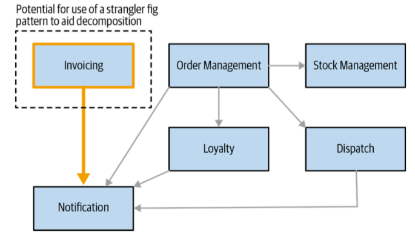
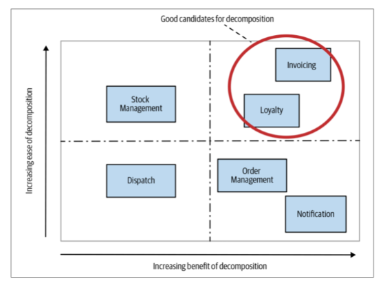

#### Reason to migrate
1. Improve team autonomy
- with MS: teams own MS, have full control over the services
- without MS: give ownership of part of codebase to different teams

2. Reduce time to market
- with MS: independent deployability
- without MS: think of all the steps involved with shipping software and identify
the bottleneck

3. Scale cost-effectively for Load
- with MS: scale independently up or down
- without MS:
    - vertical scaling
    - run multiple copy of monolith behind a LB
    - replace technology being used with alternatives: PostgeSQL => Cassandra
    
4. Improve robustness
- robustness: ability to have a system that can react to expected variations
- with MS: an impact on one are of functionality need not bring down the whole system.
- without MS: run multiple copy of monolith behind a LB

5. Embrace new technology
- with MS: use different technologies 

6. `Reuse` might be a poor reason.

#### Reason to not migrate
1. Unclear domain

If you feel that you don’t yet have a full grasp of your domain, resolving that before committing to a system decomposition may be a good idea.

2. Startup
- MS is great for "scale-ups" - startup have established at least
the fundamentals of their market fit and now scaling to increase profitability

3. Customer-installed and managed software
4. Not having a good reason
5. Cost of change is too high

#### Where to start migration
- Build bounded contexts and the relationship between them
- Consider easiest part to migrate first (normally, the contexts with few inbound dependencies)

- Also, consider the part that decomposition will bring much value

