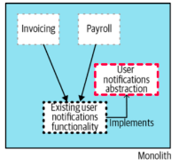

#### What
- Basic idea: 
    - create a abstraction for functionality to be replaced
    - change clients of existing functionality to use the new abstraction
    - work on the new implementation
    - switch over to use new implementation
    - clean up and remove old implementation
#### Why
- The component to be migrated can stay very deep in the system
with many other components calling it.
- Avoid disrupt for developers working on 
other parts of the codebase.
- Incremental migration. Avoid a big merge.

#### How

