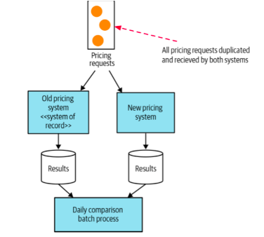

#### What
- run both old and new implementation
- the old implementation is still the source of truth
- compare the result.
#### Why
- to verify critical component
#### How

- new implementation is invisible to users
