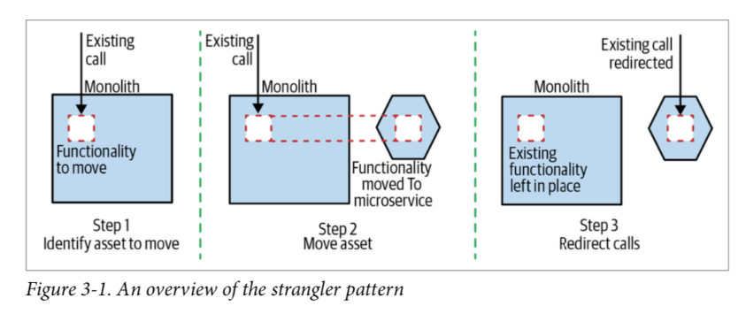
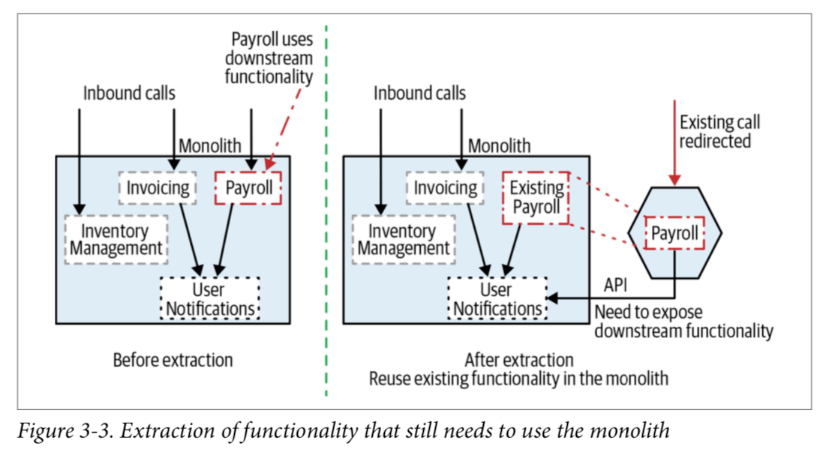
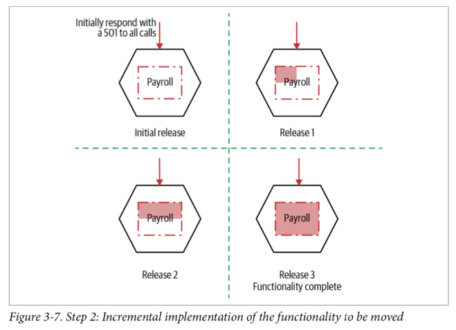
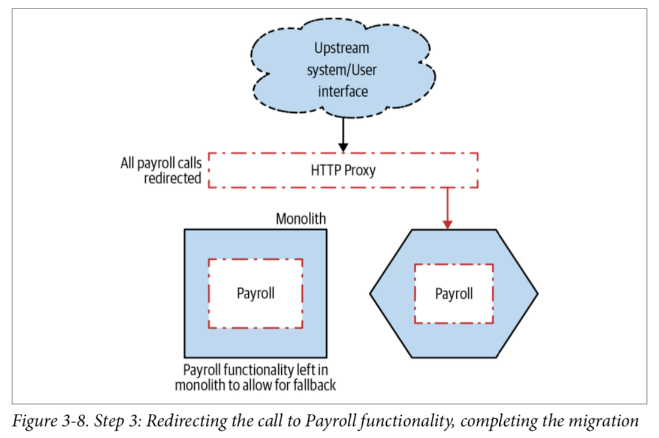
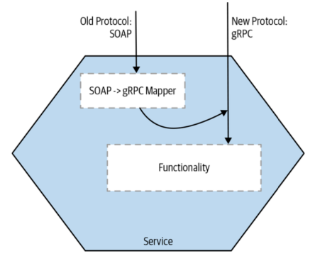

#### What?
- Basic idea: old and new system coexist, giving new system
time to grow and potentially entirely replace old system.

#### Why?
- incremental migration
- can pause and even stop migration => reducing risk
- rollback easily
#### How?

- Step 1: Identify part to move
    - insert a proxy between user and monolith: NGINX
    
- Step 2: Move it
    - may require to expose downstream functionality via APIs
    - incremental implement: deploy the unimplemented service to prod first
    to get comfortable with the prod deployment process.
    
    
    
- Step 3: Reroute call

    
    
    - if changing protocol is needed, moved that mapper to service itself 
    instead of keeping it in proxy => give us full control, avoid modifying proxy
    
    

