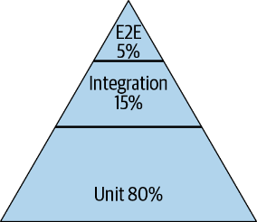
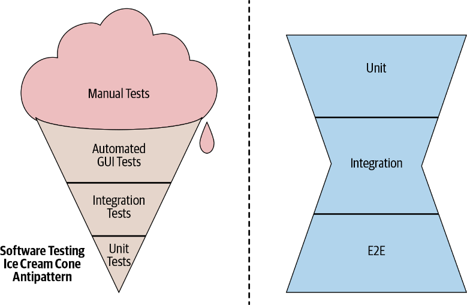

> If testing becomes a productivity sink, constantly inducing toil and uncertainty, engineers will lose trust and begin to find workarounds. A bad test suite can be worse than no test suite at all.

#### WHY?
- Manual test doesn't scale
- Safety
- Confidence
- Speed 

#### Test size
1. Small test: single process/thread
- not allow to sleep, perform I/O, make any blocking calls
2. Medium test: single machine
- can make blocking calls to localhost
- not allow to make network calls to any system other than localhost
3. Large test: run whatever it wants
- full system end to end test
- validating configuration than pieces of code
- run at release process 

#### Test flake: 
- nondeterministic behaviour in tests: clock, thread scheduling, network latency
- if test flakiness continues to grow, engineer will stop
reacting to test failures.
