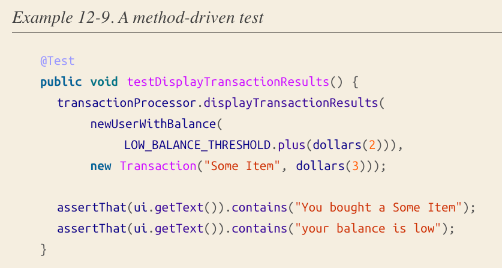

`Common problem`: develop a new feature, encounter a bunch of UT failure,
try to understand the failed UT, add some fix to those tests => make them
even more difficult to understand in the future.

=> Drag down the productivity

#### Pattern
1. Strive for unchanging test
> Ideal test is unchaning
- Pure refactorings: test should not be changed
- New features: existing test should remain unaffected
- Bug fixes: should not change existing test
- Behaviour changes: expect to update test

2. Test via Public APIs
- Unit to be tested in UT: rules of thumb:
    - if a method or class exists only to support 1 or 2 other classes => `No`
    - if a class/ package is designed to be accessible by anyone without
    having to consult with its owner => `Yes`
    - if a class/ package can be accessed only by its owner, but
    it is designed to provide functionality useful in a range of contexts => `Yes`

3. Test state, not interaction
- We should only care about `what` the result is, not `how` a system arrived at its result.
- Prefer real objects as long as it is fast and deterministic

4. Write clear tests
- `Test's clarity` = speed at which engineer can diagnose the actual problem when it fails.
- Complete: contains all information reader needs to understand
- Concise: no distracting information

```java
@Test
public void shouldPerformAddition() {
  Calculator calculator = new Calculator(new RoundingStrategy(), 
      "unused", ENABLE_COSINE_FEATURE, 0.01, calculusEngine, false);
  int result = calculator.calculate(newTestCalculation());
  assertThat(result).isEqualTo(5); // Where did this number come from?
}
```

```java
@Test
public void shouldPerformAddition() {
  Calculator calculator = newCalculator();
  int result = calculator.calculate(newCalculation(2, Operation.PLUS, 3));
  assertThat(result).isEqualTo(5);
}
```

5. Test behaviour not method
- common pitfall: every prod method has a corresponding test method
=> method being tested grows more complex => UT grows in complexity
- should test `behaviour` = how system respond to a series of inputs while in
a particular state, expressed using 
    - `given`: set up system
    - `when`: action to be taken on the syste
    - `then`: validate





6. Do not put Logic in Test


7. Shared values
- Many tests are structured by defining a set of shared values to be used by tests
=> when number of tests grows, it can be difficult to understand why
a particular value was chosen for a test.

- A better way is to construct data using a Builder


8. Shared setup
- One risk of using shared setup is they can lead to unclear
tests if those tests begin to depend on the particular values used in setup.


=> Test reader needs to go hunting to discover where `Donald Knuth` came from.

