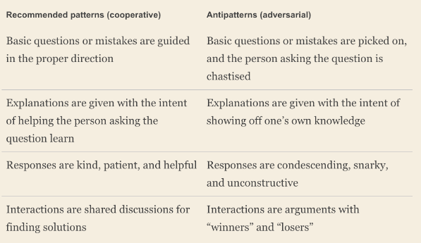

#### Challenges to Learning
- Lack of psychological safety: fear to make mistake in front of others
- Information islands:
    - information fragementation
    - information duplication
- SPoF
- Mimicry without understanding
- Haunted graveyard: avoid to touch code because
they are afraid that something might go wrong.    

#### Tackle the challenges
- Documented knowledge
- Mentorship: assign new comers a mentor - someone is not team member, manager, tech lead
=> newcomer doesn't need to worry about taking 
up too much of coworker's time.

- Ask questions: One of the biggest mistakes that beginners make is not to ask for help when they’re stuck
- Scale your questions: 
    - write down the answer for future newcomers
- Incentive and recognition
