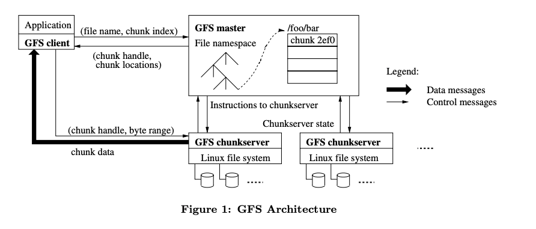

#### GFS requirement
- Big + Fast storage
- Global
- Sharding
- Auto recovery
- Internal use
- Big sequential access, files are written once, mostly appended.
- Streaming read
- Single data center

#### GFS architecture
- A file is divided into fixed-sized `chunks`: 64MB
    - reduce metadata size on Master
    - reduce network overhead
- `Chunk-servers` store chunks on local disk as Linux files.
- Each chunk replaceted acrross 3+ CS.
- Master: maintain FS metadata: namespace, access control, mapping from files to chunks,
chunks's location
    - chunk lease management
    - GC of orphaned chunks
    - chunk migration bw chunks servers

    


- GFS client linked into each app implements the file system API and
communicates with master and chunk-servers to read/write on behalf of the app.
- Clients never read and write file data through the master. Instead, a client asks
the master which chunk-servers it should contact. 

##### Metadata in Master
```text
    in Master's RAM and/or disk:

    filename -> [chunkId,...] (nv)
    chunkId  -> chunkserver list that contain this chunk (v)
                version # (nv)
                primary chunkserver (v)
                lease expiration (v)
```    
- Operation Log
    - historical record of critical metadata changes
    - stored in Disk & replicated to multiple remote servers
- Checkpoint
    - a compact B-tree form that can be used as namespace lookup without extra parsing
    - to reduce recovery time: master only need to load the latest checkpoint from local disk
    and replay only the limited number of log records after that.
    
#### Consistency model
#### Operations
##### Write (append to a file)
1. Client ------> Master: which CS hold the last chunk of the file
##### Read
    