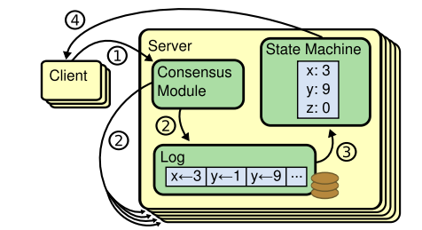

#### Architecture of replicated state machines



Each server stores a log containing a list of operators, which its state machine
executes in order. The consensus algorithm makes sure that all servers contain
the same log (consistent) => each server can computes the same state and give 
the same output for request from clients.

Flow:
1. Client sends a command to Server
2. Server add command to Log and communicate with other servers 
to ensure that every log **eventually** contains the same commands in the same 
order.
3. Once commands are properly replicated, each server process the command (by 
changing the State Machine) and return output to client.

#### Properties of Consensus algo
1. Safety - never return incorrect result to client under all non-Byzantine 
conditions: network delays, partition, packet loss, duplcation, reordering
2. Available as long as majority of servers are operational and can communicate
with each other and client.
```text
If there are 2f+1 servers, the cluster can tolerate the failure of f servers.
Majority is f+1
```
3. They do not depend on timing to ensure the consistency of log
4. Responsive: a command can completes as soon as a majority of cluster respond.

#### Raft
##### Basics
- server's state: leader, follower, candidate
    - leader handles client request. If client contacts followers, followers redirect
    to leader
    - followers are passive, they dont issue requests, only response 
    to leaders/ candidates's requests.
    - candidate is used to elect a new leader
- Raft devides time into **terms** of arbitrary length
    - terms are numbered with consecutive integers, act as logical clock
    - each term begin with an election for leader. There is at most 1 leader in
    a given term.
    
    
    - each server stores a **current term** (CT) number which increase overtime.
    Current terms are exchanged whenever servers communicate.
        - if one server's CT is < the other's, it updates its CT
        - if a candidate/ leader discover that its CT is out of date, it immediately
        reverts to follower state.
        - if a server receives request with stale term, it rejects the request

#### Properties of Raft
1. Election Safety: at most 1 leader can be elected in a given term
2. Leader Append-Only: a leader never overwrites/ deletes its entries, only append
3. Log Matching: if 2 logs contain an entry with same index and term
, then the logs are identical in all entries up through the given index
4. Leader Completeness: if a log entry is committed in a given term,
then that entry will be present in logs of leaders for all
higher-numbered terms
5. State Machine Safety: if a server has applied a log entry at a given index
to its state machine, no other server will ever apply a different log entry
for the same index.

#### Leader election        


#### Log replication
- Log entry = index, term, command
- Log stored on disk, survives crashes
- Committed entry: if leader decides that it is safe to apply it to state machine
i.e the leader that created the entry has replicated it on a majority of the servers.

