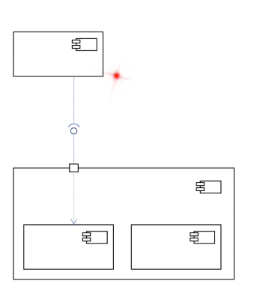

## Unified Modeling Language
### Popular diagram
#### Component diagram
- show components
- show implemented and required interface

#### Class diagram
- **Let tech lead do this part**
- Show classes
- Show methods and fields
- Show association, generalization and cardinality

#### Sequence diagram
- Show call sequence
- Show calling class,called method, return data type
- Depict loop

#### State diagram
- Show states/ activities
- Show transitions

#### Activity diagram

#### Layer diagram
- Show area of concern
- Show ref between area

#### Use Case diagram

### Strategies
- UML as Sketch
- UML as blueprint
- UML as validation

