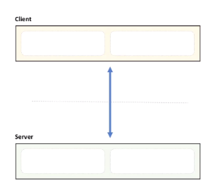
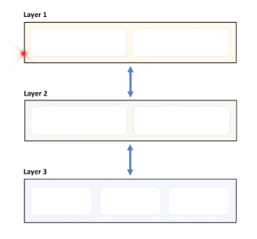
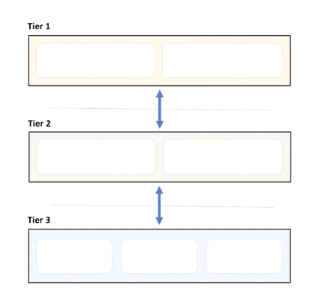

#### Client/Server

- Centralize control

#### Layered Pattern

- structure area of concern
- layers can only communicate with peer above/ below

Cons:
- Deep call chains
- May harm performance

#### N-Tier Pattern

- same as Layered layer except each layer is in a separated server
Pros:
- scale out
- high abstraction, isolation
Cons:
- network = SPoF
- network may be slow
- hard to debug
