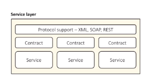
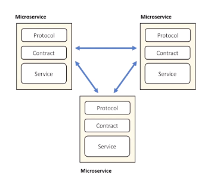
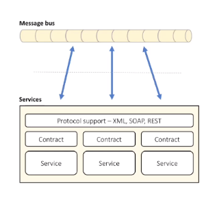

#### Service-oriented pattern

- use network to communicate
- HTTP, XML, SOAP, Binary

#### Micro-service

- services calling services
- can use fast private network
- deployed on multiple servers

#### Message-bus pattern

- services connected to shared data bus
- user message for communication
- support discovery, failover

Cons
- bus == SPoF
- can be slow
- hard to test, debug
