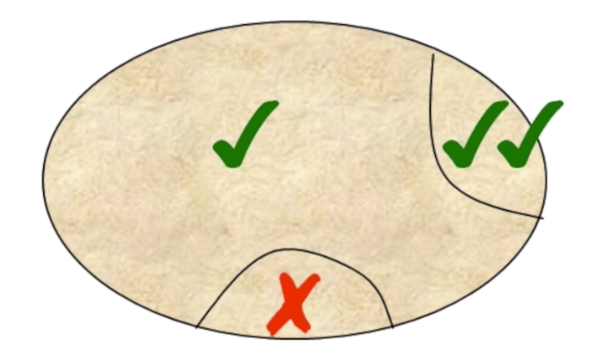

1. Tick: Normal operation
2. Double tick: thing that you do really well
3. `X`: need improvement area

The Leader should focus on Double tick. If you focus on the bad bit:
    
    - person avoid doing to bad bit
    - not bother double tick
    
    => performance reduced.
    
What leader should do
- recognize and praise the double tick area
- supportive improvement: 
    - it gonna be fine next time, mistake happens.
    - what will you do differently next time?
    - I will coach you, we work on it together